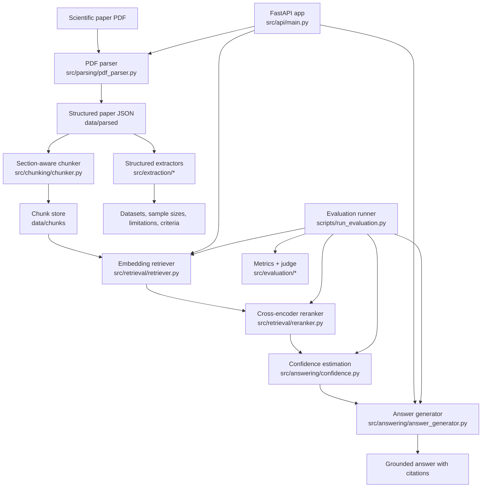

# Reliable Scientific Paper Copilot

A local-first AI assistant for reading, understanding, and answering questions about scientific papers.

## Features

- **PDF Parsing**: Extract structured text and metadata from scientific papers
- **Section-Aware Chunking**: Split papers into meaningful chunks with section metadata
- **Hybrid Retrieval**: Combine dense FAISS search with BM25 lexical scoring
- **Cross-Encoder Reranking**: Reorder retrieved passages with a higher-precision reranker
- **Grounded Generation**: Answer questions with citations from the paper
- **Answer Quality Scoring**: Optional LLM-as-judge rubric for groundedness, correctness, completeness, and overall quality
- **Lightweight Web UI**: Browser-based upload and Q&A workflow served directly by the FastAPI app, including dense, lexical, and hybrid retrieval controls, per-chunk score breakdowns, and recent per-paper question history for demos/debugging
- **Persistent Paper Registry**: Stored paper metadata now includes artifact validation summaries and file size metadata for uploaded PDFs

## Architecture



### Component notes

- **Ingestion path**: uploaded PDFs are parsed into structured JSON, then chunked and persisted for retrieval.
- **Retrieval path**: dense retrieval and BM25 lexical retrieval can be fused before reranking, and confidence estimation decides whether the evidence is good enough to answer.
- **Extraction path**: targeted extractors pull fields like datasets, sample sizes, limitations, and inclusion or exclusion criteria directly from the parsed paper.
- **Evaluation path**: experiment configs, regression comparison, and answer-quality judging make it possible to compare pipeline variants reliably.

## Quick Start

```bash
make install
make run-api
```

If you prefer not to use `make`, the equivalent commands still work:

```bash
pip install -r requirements.txt
python -m src.api.main
```

## Docker

Build and run the API with Docker Compose:

```bash
docker compose up --build
```

The API will be available at `http://localhost:8000`, and local `./data` is mounted into the container at `/app/data` so uploaded papers and indexes persist across restarts.

For deployment guidance, including when to keep the app fully local versus when a split-host browser-assisted demo setup is reasonable, see [`docs/deployment.md`](docs/deployment.md).

## API Endpoints

- `GET /` - Lightweight web UI
- `POST /upload` - Upload and process a PDF
- `POST /ask` - Ask a question about a processed paper
- `GET /papers/{paper_id}/brief` - Fetch a compact demo-ready paper brief with overview, study signals, and ingestion context
- `GET /papers/{paper_id}/brief/export` - Export the paper brief as shareable Markdown for notes or demos
- `GET /papers/{paper_id}/activity` - Fetch recent ask history for a paper, including latency, retrieval telemetry, and retrieval configuration recap
- `GET /papers/{paper_id}/activity/export` - Export recent per-paper ask history as a shareable Markdown transcript with retrieval configuration details
- `GET /health` - Health check

`POST /ask` also accepts optional retrieval controls for experiments and debugging:
- `retrieval_mode`: `dense`, `lexical`, or `hybrid`
- `dense_weight`, `lexical_weight`, `rrf_k`: hybrid fusion settings

The response now includes `retrieval_mode` plus `retrieval_scores` entries with per-chunk rank and dense, lexical, or hybrid score fields when available. The built-in web UI also exposes these retrieval controls and shows the returned score breakdown for debugging and demos.

## Project Structure

```
reliable-paper-copilot/
├── configs/         # Configuration files
├── data/            # Data storage
│   ├── raw/         # Raw uploaded PDFs
│   ├── parsed/      # Parsed paper JSON
│   ├── chunks/      # Chunked text with metadata
│   └── eval/        # Evaluation data
├── src/
│   ├── parsing/     # PDF parsing module
│   ├── chunking/    # Section-aware chunking
│   ├── retrieval/   # Embedding and FAISS retrieval
│   ├── prompting/   # Prompt templates
│   ├── answering/   # Answer generation
│   ├── evaluation/  # Evaluation metrics
│   ├── api/         # FastAPI application
│   └── utils/       # Utility functions
├── scripts/         # Helper scripts
├── notebooks/       # Jupyter notebooks
├── tests/           # Unit tests
└── docker/          # Docker configuration
```

## Common Workflows

```bash
make help
make test
make run-api
make run-ui
make ingest PAPER=path/to/paper.pdf
make fetch-sample-package
make demo-sample-package
make demo-sample-package QUESTION_ID=architecture
make eval
make eval EVAL_CONFIG=configs/experiments/hybrid-retrieval.yaml
make compare-experiments BASELINE=artifacts/experiments/run-a/results.json CANDIDATE=artifacts/experiments/run-b/results.json
make benchmark-report REPORT_RESULTS=artifacts/experiments/latest/results.json
```

`make run-ui` is an alias for `make run-api`, because the browser UI is served directly by the FastAPI app at `http://localhost:8000`.

## Reproducible sample real-paper demo

The repo includes a versioned sample package for `Attention Is All You Need` under `sample_packages/attention-is-all-you-need/`.
Use it when you want a consistent portfolio demo with one known paper and a small set of canned questions.

### 1. Install dependencies and fetch the sample PDF

```bash
make install
make fetch-sample-package
```

That downloads the paper to `data/raw/attention-is-all-you-need.pdf`.
The package metadata and demo questions live here:

- `sample_packages/attention-is-all-you-need/manifest.json`
- `sample_packages/attention-is-all-you-need/questions.json`

### 2. Fastest end-to-end demo path

If you just want one reproducible command that downloads the packaged PDF, ingests it, and asks a canned question end-to-end, run:

```bash
make demo-sample-package
```

That uses the packaged `motivation` question by default, prints a JSON payload containing the upload metadata plus the answer response, and also persists a reusable transcript under `artifacts/demo/`.
Each run writes a timestamped `artifacts/demo/<timestamp>-<package>-<question>.json` file and refreshes `artifacts/demo/latest.json` for quick reuse in demos or screenshots.
You can swap in a different canned prompt, for example:

```bash
make demo-sample-package QUESTION_ID=architecture
```

### 3. Start the local API manually

```bash
make run-api
```

Keep that process running in one terminal.
In a second terminal, upload the sample paper:

```bash
curl --fail --show-error -X POST \
  -F "file=@data/raw/attention-is-all-you-need.pdf;type=application/pdf" \
  http://127.0.0.1:8000/upload
```

Copy the returned `paper_id`.
If you prefer the browser flow, open `http://127.0.0.1:8000` and upload the same file through the built-in web UI.

### 4. Ask the packaged demo questions

Use the sample package questions directly against `/ask`.
Example:

```bash
curl --fail --show-error -X POST \
  -H "Content-Type: application/json" \
  -d '{
    "paper_id": "<paper_id>",
    "question": "What are the main components of the Transformer encoder and decoder?",
    "top_k": 5,
    "retrieval_mode": "hybrid"
  }' \
  http://127.0.0.1:8000/ask
```

Recommended live-demo sequence:

1. motivation question
2. architecture question
3. results question

Those prompts are already listed in `sample_packages/attention-is-all-you-need/questions.json`, along with the expected answer focus for each one.

### 5. Inspect persisted paper metadata

After upload, confirm the paper registry captured the paper and its ingestion metadata:

```bash
curl --fail --show-error http://127.0.0.1:8000/papers
```

For one paper specifically:

```bash
curl --fail --show-error http://127.0.0.1:8000/papers/<paper_id>/status
```

For a compact, shareable paper brief that rolls up the key metadata, extracted study signals, and ingestion notes:

```bash
curl --fail --show-error http://127.0.0.1:8000/papers/<paper_id>/brief
```

### 6. Run the reproducible evaluation pass

The sample package is for ingestion and QA demos. For a stable metrics pass that works on a fresh machine, run the existing eval set:

```bash
make eval EVAL_CONFIG=configs/experiments/hybrid-retrieval.yaml
```

Then turn the latest `results.json` into a shareable summary:

```bash
make benchmark-report REPORT_RESULTS=artifacts/experiments/hybrid-retrieval/results.json
```

### 7. Optional: demo the notebook walkthrough

For a shorter scripted walkthrough, open:

- `notebooks/reliable_paper_copilot_demo.ipynb`

That notebook uses a tiny generated PDF for portability, while the sample package above gives you a real-paper ingestion path for portfolio demos.

## Evaluation

```bash
make eval
make eval EVAL_CONFIG=configs/experiments/hybrid-retrieval.yaml
```

The evaluation runner now reports both classic QA metrics and an answer-quality rubric:
- exact match
- token F1
- retrieval hit rate / MRR
- answerable vs unanswerable slice breakdowns
- refusal accuracy, precision, recall, false-refusal rate, and missed-refusal rate
- groundedness
- correctness
- completeness
- overall answer quality

Persisted experiment summaries now include an answerability slice table plus a refusal confusion summary, which makes it easier to spot whether the system is over-refusing answerable questions or failing to abstain on unanswerable ones.

The current implementation uses a pluggable judge interface, with a deterministic mock judge for local testing.

## Phase 1 MVP

- PDF parsing with pdfplumber
- Section-aware chunking
- FAISS-based retrieval with sentence-transformers
- FastAPI REST API
- Basic evaluation metrics
