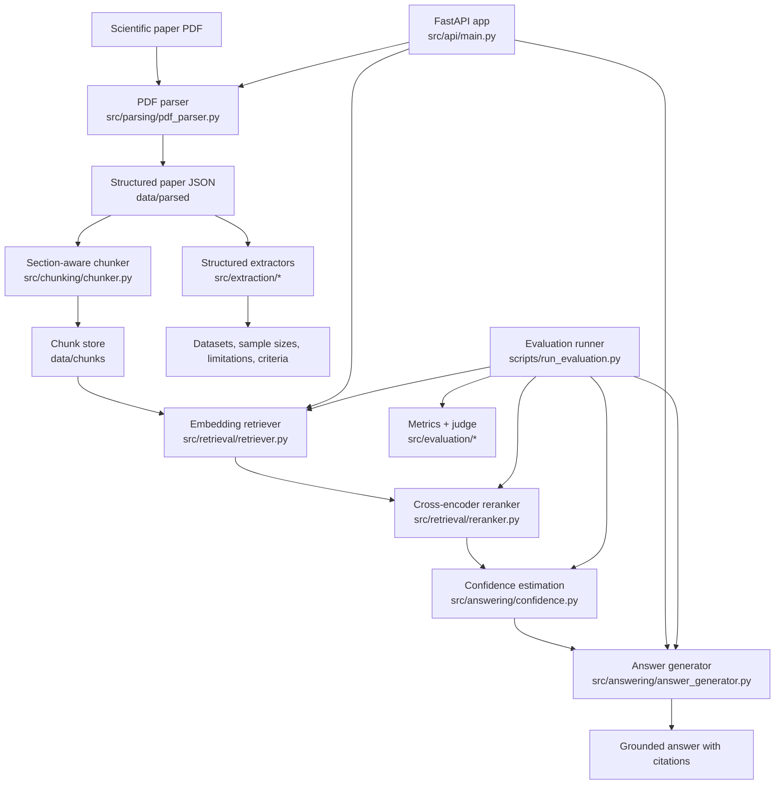

# Reliable Scientific Paper Copilot

A local-first AI assistant for reading, understanding, and answering questions about scientific papers.

## Features

- **PDF Parsing**: Extract structured text and metadata from scientific papers
- **Section-Aware Chunking**: Split papers into meaningful chunks with section metadata
- **Hybrid Retrieval**: Combine dense FAISS search with BM25 lexical scoring
- **Cross-Encoder Reranking**: Reorder retrieved passages with a higher-precision reranker
- **Grounded Generation**: Answer questions with citations from the paper
- **Answer Quality Scoring**: Optional LLM-as-judge rubric for groundedness, correctness, completeness, and overall quality
- **Lightweight Web UI**: Browser-based upload and Q&A workflow served directly by the FastAPI app, including dense, lexical, and hybrid retrieval controls plus per-chunk score breakdowns
- **Persistent Paper Registry**: Stored paper metadata now includes artifact validation summaries and file size metadata for uploaded PDFs

## Architecture



### Component notes

- **Ingestion path**: uploaded PDFs are parsed into structured JSON, then chunked and persisted for retrieval.
- **Retrieval path**: dense retrieval and BM25 lexical retrieval can be fused before reranking, and confidence estimation decides whether the evidence is good enough to answer.
- **Extraction path**: targeted extractors pull fields like datasets, sample sizes, limitations, and inclusion or exclusion criteria directly from the parsed paper.
- **Evaluation path**: experiment configs, regression comparison, and answer-quality judging make it possible to compare pipeline variants reliably.

## Quick Start

```bash
pip install -r requirements.txt
python -m src.api.main
```

## Docker

Build and run the API with Docker Compose:

```bash
docker compose up --build
```

The API will be available at `http://localhost:8000`, and local `./data` is mounted into the container at `/app/data` so uploaded papers and indexes persist across restarts.

## API Endpoints

- `GET /` - Lightweight web UI
- `POST /upload` - Upload and process a PDF
- `POST /ask` - Ask a question about a processed paper
- `GET /health` - Health check

`POST /ask` also accepts optional retrieval controls for experiments and debugging:
- `retrieval_mode`: `dense`, `lexical`, or `hybrid`
- `dense_weight`, `lexical_weight`, `rrf_k`: hybrid fusion settings

The response now includes `retrieval_mode` plus `retrieval_scores` entries with per-chunk rank and dense, lexical, or hybrid score fields when available. The built-in web UI also exposes these retrieval controls and shows the returned score breakdown for debugging and demos.

## Project Structure

```
reliable-paper-copilot/
├── configs/         # Configuration files
├── data/            # Data storage
│   ├── raw/         # Raw uploaded PDFs
│   ├── parsed/      # Parsed paper JSON
│   ├── chunks/      # Chunked text with metadata
│   └── eval/        # Evaluation data
├── src/
│   ├── parsing/     # PDF parsing module
│   ├── chunking/    # Section-aware chunking
│   ├── retrieval/   # Embedding and FAISS retrieval
│   ├── prompting/   # Prompt templates
│   ├── answering/   # Answer generation
│   ├── evaluation/  # Evaluation metrics
│   ├── api/         # FastAPI application
│   └── utils/       # Utility functions
├── scripts/         # Helper scripts
├── notebooks/       # Jupyter notebooks
├── tests/           # Unit tests
└── docker/          # Docker configuration
```

## Evaluation

```bash
python scripts/run_evaluation.py
python scripts/run_evaluation.py --config configs/experiments/hybrid-retrieval.yaml
```

The evaluation runner now reports both classic QA metrics and an answer-quality rubric:
- exact match
- token F1
- retrieval hit rate / MRR
- answerable vs unanswerable slice breakdowns
- refusal accuracy, precision, recall, false-refusal rate, and missed-refusal rate
- groundedness
- correctness
- completeness
- overall answer quality

Persisted experiment summaries now include an answerability slice table plus a refusal confusion summary, which makes it easier to spot whether the system is over-refusing answerable questions or failing to abstain on unanswerable ones.

The current implementation uses a pluggable judge interface, with a deterministic mock judge for local testing.

## Phase 1 MVP

- PDF parsing with pdfplumber
- Section-aware chunking
- FAISS-based retrieval with sentence-transformers
- FastAPI REST API
- Basic evaluation metrics
